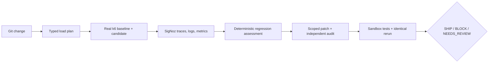

# TraceForge

**Load-test your change. Find the regression in SigNoz. Write and verify the fix.**

TraceForge is an evidence-first pre-production reliability agent. It inspects a Git change,
generates a constrained k6 experiment, compares the base and candidate revisions, investigates the
exact experiment windows through SigNoz MCP, and applies any proposed remediation only in an
isolated Git worktree. A patch can ship only after tests, identical load, and server-side telemetry
prove the improvement.

> Prototype status: the local workflow and real load execution are implemented. Evidence-backed
> diagnosis and SHIP proof require the
> environment variables in `.env.example`; without them TraceForge reports
> **“SigNoz verification unavailable”** and never fabricates evidence.

## Why this exists

Pre-production checks commonly tell a reviewer that tests passed without showing how a change
behaves under concurrency or where server time is spent. TraceForge turns that gap into a governed
experiment:



SigNoz is not a presentation layer in this design. The state machine will not advance to
`TELEMETRY_CONFIRMED`, issue an evidence-backed diagnosis, or publish a telemetry-dependent SHIP
verdict unless MCP returns the expected service and correlated run data.

## Quick start

Prerequisites: Python 3.12, [uv](https://docs.astral.sh/uv/), Node 22+, pnpm, Git, and k6 v2+.

```powershell
Copy-Item .env.example .env
uv sync --all-extras
uv run traceforge doctor
uv run python scripts/bootstrap_demo_repo.py
```

macOS/Linux:

```bash
cp .env.example .env
uv sync --all-extras
uv run traceforge doctor
uv run python scripts/bootstrap_demo_repo.py
```

Start the API and web application:

```bash
uv run uvicorn traceforge.api:app --host 127.0.0.1 --port 8787
pnpm install
pnpm dev
```

Run the CLI demo after setting SigNoz and OTLP credentials:

```bash
uv run traceforge demo lock
uv run traceforge demo latency
uv run traceforge demo control
```

Or analyze a trusted local repository:

```bash
uv run traceforge analyze \
  --repo ./fixtures/generated-demo-repositories/traceforge-demo \
  --base-ref demo-baseline \
  --candidate-ref demo-lock \
  --target-command "python -m uvicorn app:app --host 127.0.0.1 --port 8099" \
  --target-url http://127.0.0.1:8099 \
  --profile demo
```

Local target startup is disabled unless `TRACEFORGE_TRUSTED_LOCAL_MODE=true`. Public API requests
cannot submit startup commands.

## Environment

Telemetry ingestion and MCP control-plane credentials are deliberately separate:

- `SIGNOZ_INGESTION_KEY`, `OTEL_EXPORTER_OTLP_ENDPOINT`, and
  `OTEL_EXPORTER_OTLP_HEADERS` send OTLP data.
- `SIGNOZ_API_KEY`, `SIGNOZ_INSTANCE_URL`, and `SIGNOZ_MCP_URL` query the SigNoz MCP server.
- `TRACEFORGE_ALLOWED_REPO_ROOTS` and `TRACEFORGE_ALLOWED_TARGETS` constrain local execution.

See [.env.example](.env.example) and [SigNoz setup](docs/SIGNOZ_SETUP.md).

## Repository map

- `services/orchestrator`: FastAPI API, CLI, deterministic engine, MCP adapter, and telemetry.
- `services/demo-target`: instrumented FastAPI/SQLite source for generated Git scenarios.
- `apps/web`: live control room and evidence UI.
- `tests`: unit, integration, opt-in real SigNoz, and end-to-end checks.
- `docs`: architecture, threat model, demo, benchmarks, and hackathon submission.

## Security model

Subprocesses use argument arrays and timeouts. Repositories and targets are allowlisted. Generated
k6 is compiled from typed data, patches are scope-checked before `git apply`, credentials are
redacted, and repository/MCP/model content is always treated as untrusted. Patch verification runs
only in managed worktrees. See [THREAT_MODEL.md](docs/THREAT_MODEL.md).

## Benchmarks

A real local lock-contention smoke run is published with its raw machine-readable record. It is
explicitly labeled as a single measurement with SigNoz unavailable; the repeated accuracy suite remains
planned. See [BENCHMARKS.md](docs/BENCHMARKS.md).

## Screenshots

Screenshots will be captured from real runs after SigNoz credentials are connected. No synthetic
dashboard image is included.

## Known limitations

- A real SigNoz account is required to demonstrate evidence-backed diagnosis and SHIP proof.
- General repositories may need an explicit target lifecycle adapter and request-body examples.
- The default local trust mode intentionally refuses to execute repository code.
- Statistical confidence is limited by hackathon-safe load durations and is reported honestly.

## Hackathon alignment

TraceForge targets **AI & Agent Observability** twice: it treats SigNoz telemetry as the decision
source for code-change investigation, and it exports its own governed agent workflow as
OpenTelemetry spans.

## AI Assistance Disclosure

OpenAI Codex assisted with architecture, implementation, tests, and documentation. Deterministic
code—not a language model—owns regression calculations, legal state transitions, patch scope
checks, ledger integrity, and verdict gates. Generated work is reviewed through executable tests.

## Originality

TraceForge is an original implementation with its own forge/flight-recorder identity, typed
contracts, state machine, telemetry contract, hash-chained audit ledger, interface, documentation,
and benchmarks. It does not copy Kassi source, naming, UI, terminal design, visuals, or text.

## License

Apache License 2.0. See [LICENSE](LICENSE).

