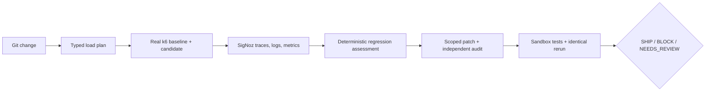

# TraceForge

**Load-test your change. Find the regression in SigNoz. Write and verify the fix.**

TraceForge is an evidence-first pre-production reliability agent. It inspects a Git change,
generates a constrained k6 experiment, compares the base and candidate revisions, investigates the
exact experiment windows through SigNoz MCP, and applies any proposed remediation only in an
isolated Git worktree. A patch can ship only after tests, identical load, and server-side telemetry
prove the improvement.

> Status: the full loop runs end to end against live SigNoz Cloud. The lock, silent-latency, and
> control scenarios were each executed on 2026-07-25 with real OTLP ingestion and real MCP evidence
> retrieval; the numbers below are from those runs. Evidence-backed diagnosis and SHIP proof require
> the environment variables in `.env.example`; without them TraceForge reports
> **“SigNoz verification unavailable”** and never fabricates evidence.

## Why this exists

Pre-production checks commonly tell a reviewer that tests passed without showing how a change
behaves under concurrency or where server time is spent. TraceForge turns that gap into a governed
experiment:



SigNoz is not a presentation layer in this design. The state machine will not advance to
`TELEMETRY_CONFIRMED`, issue an evidence-backed diagnosis, or publish a telemetry-dependent SHIP
verdict unless MCP returns the expected service and correlated run data.

## The result that motivates the whole design

Run `a2a7d676-038f-4e3c-8fd5-10cc3b8246b7`, `uv run traceforge demo lock --profile demo`:

| Measurement | Baseline | Candidate | Patched |
| --- | ---: | ---: | ---: |
| P95 latency | 713.40 ms | **364.11 ms** | 607.55 ms |
| P99 latency | 2,758.95 ms | **444.80 ms** | 2,453.45 ms |
| Throughput | 86.87 req/s | **116.06 req/s** | 94.52 req/s |
| HTTP failure rate | 0.18% | **94.55%** | 0.07% |

A latency dashboard would call that candidate an improvement. It is not. The candidate's P95 fell and
its throughput rose **because 94.55% of its requests failed fast** with `database is locked` instead
of doing the write. TraceForge classifies on the failure rate, labels the latency columns as
misleading in the release-proof view, and only accepts the patched phase — 0.07% failures at
baseline-like latency — as the improvement that justifies `SHIP`.

The silent-latency scenario is the mirror image: run `45674c9c-bc70-4e64-9664-8bb9ae0ad1bf` kept a
0.00% failure rate on every request while P95 went 103.91 ms → 2,376.92 ms with an ordered-window
slope of +320.99 ms per window. The control scenario, run `a53f317c-a4c9-4843-8441-9cb3fa0f3da9`,
measured `NO_REGRESSION` and generated no patch at all. Full tables, including a false positive we
found and fixed, are in [BENCHMARKS.md](docs/BENCHMARKS.md).

## Quick start

Prerequisites: Python 3.12, [uv](https://docs.astral.sh/uv/), Node 22+, pnpm, Git, and k6 v2+.

```powershell
Copy-Item .env.example .env
uv sync --all-extras
uv run traceforge doctor
uv run python scripts/bootstrap_demo_repo.py
```

macOS/Linux:

```bash
cp .env.example .env
uv sync --all-extras
uv run traceforge doctor
uv run python scripts/bootstrap_demo_repo.py
```

Start the API and web application:

```bash
uv run uvicorn traceforge.api:app --host 127.0.0.1 --port 8787
pnpm install
pnpm dev
```

Run the CLI demo after setting SigNoz and OTLP credentials:

```bash
uv run traceforge demo lock
uv run traceforge demo latency
uv run traceforge demo control
```

Or analyze a trusted local repository:

```bash
uv run traceforge analyze \
  --repo ./fixtures/generated-demo-repositories/traceforge-demo \
  --base-ref demo-baseline \
  --candidate-ref demo-lock \
  --target-command "python -m uvicorn app:app --host 127.0.0.1 --port 8099" \
  --target-url http://127.0.0.1:8099 \
  --profile demo
```

Local target startup is disabled unless `TRACEFORGE_TRUSTED_LOCAL_MODE=true`. Public API requests
cannot submit startup commands.

## Environment

Telemetry ingestion and MCP control-plane credentials are deliberately separate:

- `SIGNOZ_INGESTION_KEY`, `OTEL_EXPORTER_OTLP_ENDPOINT`, and
  `OTEL_EXPORTER_OTLP_HEADERS` send OTLP data.
- `SIGNOZ_API_KEY`, `SIGNOZ_INSTANCE_URL`, and `SIGNOZ_MCP_URL` query the SigNoz MCP server.
- `TRACEFORGE_ALLOWED_REPO_ROOTS` and `TRACEFORGE_ALLOWED_TARGETS` constrain local execution.

See [.env.example](.env.example) and [SigNoz setup](docs/SIGNOZ_SETUP.md).

## Repository map

- `services/orchestrator`: FastAPI API, CLI, deterministic engine, MCP adapter, and telemetry.
- `services/demo-target`: instrumented FastAPI/SQLite source for generated Git scenarios.
- `apps/web`: live control room and evidence UI.
- `tests`: unit, integration, opt-in real SigNoz, and end-to-end checks.
- `docs`: architecture, threat model, demo, benchmarks, and hackathon submission.

## Security model

Subprocesses use argument arrays and timeouts. Repositories and targets are allowlisted. Generated
k6 is compiled from typed data, patches are scope-checked before `git apply`, credentials are
redacted, and repository/MCP/model content is always treated as untrusted. Patch verification runs
only in managed worktrees. See [THREAT_MODEL.md](docs/THREAT_MODEL.md).

## Release Proof dashboard

`http://127.0.0.1:3000` opens the Control Room. Selecting a completed run opens **Release Proof**,
which is built entirely from persisted run data served by the existing API: run overview, the
three-phase comparison with per-metric caveats, the experiment timeline, the deterministic
classification and its gate inputs, the root-cause diagnosis, per-phase SigNoz evidence with trace
IDs and correlated logs, the generated diff, the four independent patch-audit checks, sandbox
verification, ledger verification, and the final verdict. Live runs stream stage transitions,
per-phase progress, and MCP activity over the existing SSE channel. Deep links open the matching
trace or service in SigNoz whenever the persisted evidence contains a usable URL.

## Native SigNoz dashboard

A native dashboard definition named **TraceForge — Release Proof** ships at
`infra/signoz/traceforge-release-proof.dashboard.json` (three variables, sixteen trace- and
log-derived panels, including TraceForge's own stage durations and MCP tool failures).

```bash
uv run traceforge dashboard publish --dry-run
uv run traceforge dashboard publish
```

The hosted MCP server exposes dashboard write tools, but a least-privilege read-only service account
is refused by the SigNoz API with `403: only editors/admins can access this resource`. Publish with
an editor or admin key, or import the JSON from **Dashboards → New dashboard → Import JSON**. See
[SIGNOZ_SETUP.md](docs/SIGNOZ_SETUP.md).

## Benchmarks

Three live scenarios, two lock runs, ledger tamper detection, and the self-observability span
inventory are published with the exact commands and run IDs, and separated from what remains planned
or unavailable. See [BENCHMARKS.md](docs/BENCHMARKS.md).

## Screenshots

The capture list, with the exact run IDs and views to use, is in
[SCREENSHOTS.md](docs/SCREENSHOTS.md). Images are captured from real runs; no synthetic dashboard
image is included in this repository.

## Known limitations

- A real SigNoz account is required to demonstrate evidence-backed diagnosis and SHIP proof.
- Publishing the native SigNoz dashboard needs an editor or admin API key; the read-only key this
  project recommends for evidence retrieval cannot write dashboards.
- Each scenario has been measured once or twice, so classifications are reproducible but absolute
  latencies are machine-specific. The repeated accuracy suite is still planned.
- Throughput comparisons are interpreted against a closed-loop k6 plan: a drop that the latency
  change alone predicts is reported as explained rather than counted as an independent regression.
- General repositories may need an explicit target lifecycle adapter and request-body examples.
- The default local trust mode intentionally refuses to execute repository code.

## Hackathon alignment

TraceForge targets **AI & Agent Observability** twice: it treats SigNoz telemetry as the decision
source for code-change investigation, and it exports its own governed agent workflow as
OpenTelemetry spans. A single lock run is queryable in SigNoz as 15 named workflow stages plus one
span per MCP tool call, all carrying `traceforge.run.id`.

## AI Assistance Disclosure

OpenAI Codex assisted with architecture, implementation, tests, and documentation. Deterministic
code—not a language model—owns regression calculations, legal state transitions, patch scope
checks, ledger integrity, and verdict gates. Generated work is reviewed through executable tests.

## Originality

TraceForge is an original implementation with its own forge/flight-recorder identity, typed
contracts, state machine, telemetry contract, hash-chained audit ledger, interface, documentation,
and benchmarks. It does not copy Kassi source, naming, UI, terminal design, visuals, or text.

## License

Apache License 2.0. See [LICENSE](LICENSE).

