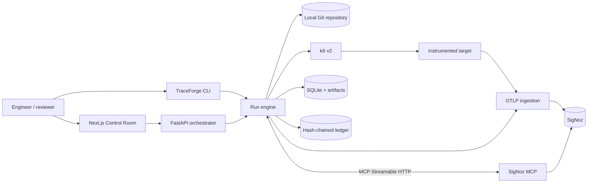
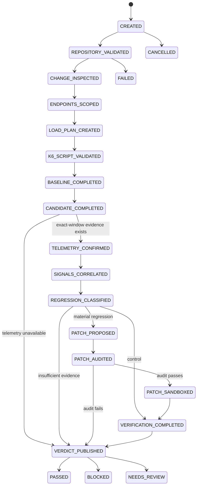
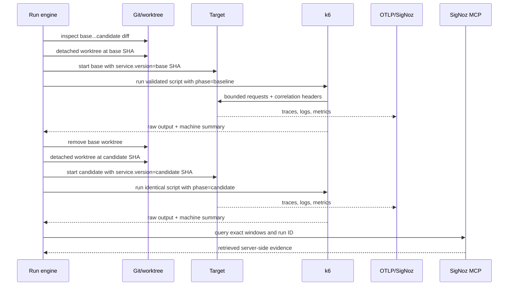
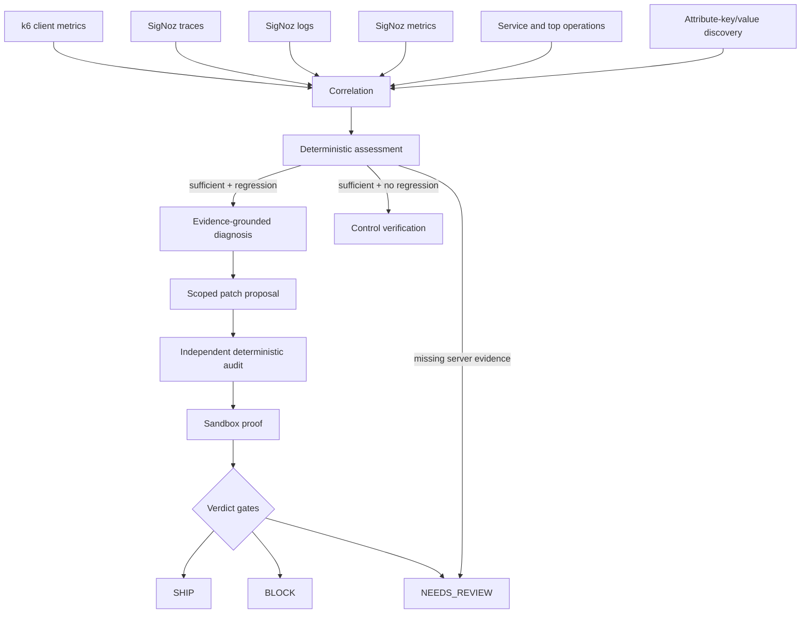
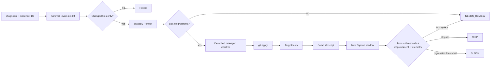
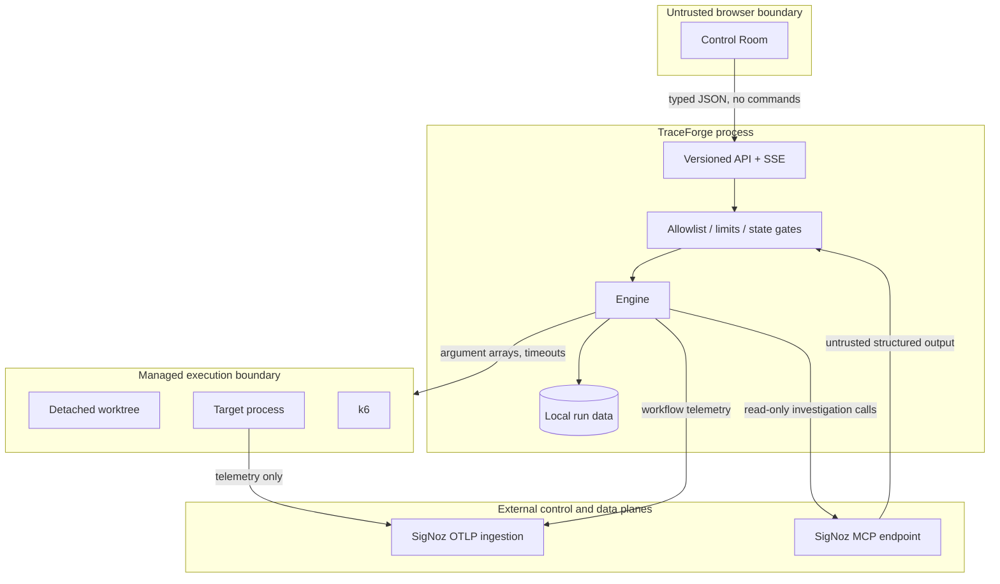

# TraceForge architecture

TraceForge is a deterministic reliability workflow with an observability-backed evidence boundary.
Language-model integration is optional; it cannot advance state, classify a regression, authorize a
patch, or publish a verdict.

## 1. System context

The API never accepts a startup command. Local code execution is available only from the CLI when
`TRACEFORGE_TRUSTED_LOCAL_MODE=true`, the repository resolves beneath an allowlisted root, and the
target host is allowlisted.

## 2. Deterministic state machine

Every transition has a stable event ID. SQLite enforces idempotency and the ledger records the
previous state, next state, actor, action, input/output digests, evidence IDs, prior hash, and event
hash. Replaying the same transition does not append a second event.

## 3. Experiment sequence

The generated script is a pure compilation of a validated `LoadTestPlan`. The same script digest is
required for baseline, candidate, and patched phases. Profiles impose hard VU and time budgets.

## 4. Evidence and decision flow

Client measurements alone never count as sufficient evidence. Missing credentials, a missing
service, absent correlated traces, an ingestion timeout, MCP schema drift, or a required tool
failure all produce the explicit message `SigNoz verification unavailable`.

## 5. Patch sandbox and proof

The source checkout is not mutated. Patch application and cleanup are constrained to the run's
managed worktree directory. Patch text is rejected if it touches files outside the original change
set or contains credential-like material.

## 6. Trust and deployment boundaries

## Components and durable data

| Component | Responsibility | Durable output |
| --- | --- | --- |
| `traceforge.engine` | Legal workflow orchestration and verdict gates | Serialized `TraceForgeRun` |
| `traceforge.git_inspector` | Revision validation, merge base, diff metadata | `change.diff`, change digest |
| `traceforge.endpoints` | Changed-hunk-aware FastAPI endpoint scoping | Ranked typed endpoints |
| `traceforge.load_plan` / `k6` | Bounded plan, script rendering, validation, execution | Script, summary, raw k6 log |
| `traceforge.signoz` | Runtime discovery and exact-window evidence retrieval | Sanitized MCP invocations and evidence |
| `traceforge.regression` | Numeric deltas, slopes, deterministic classification | Regression assessment |
| `traceforge.patching` / `worktree` | Reversion proposal, audit, isolated proof | Diff, audit, test/load proof |
| `traceforge.ledger` | Tamper-evident transition record | Per-run JSONL hash chain |
| `traceforge.release_proof` | Read-only projection of a run into a presentation contract | None |
| `apps/web` | API-backed live UI with partial/unavailable states | None |

SQLite stores current run state and transition idempotency records. Large raw outputs remain as
separate files under `.traceforge/runs/<run-id>/`; the database stores paths and typed summaries.

## Release-proof projection

`traceforge.release_proof` derives the presentation contract that the Release Proof page consumes. It
adds no new measurements. It reads the persisted run, intersects each retrieved span and log timestamp
with the exact phase window so evidence is attributed to the phase that produced it, and attaches
per-metric caveats where a raw delta would mislead — a latency improvement that accompanies a high
failure rate, or a throughput drop that the latency change alone predicts. Interpretation notes are
generated from the same persisted values, so the UI never computes a number the backend has not
recorded.

## Self-observability

The orchestrator exports its own workflow to the same SigNoz instance under service
`traceforge-orchestrator`. Each stage emits a span named after the stage, each SigNoz MCP tool
invocation emits a `signoz.mcp.call` span carrying `traceforge.mcp.tool` and success state, and all of
them carry `traceforge.run.id`, so one run's orchestration is isolatable. Target telemetry stays on
its own service name, which keeps the agent's spans from polluting the evidence it queries.

## Verdict invariants

`SHIP` requires every one of the following:

1. correlated baseline, candidate, and (when applicable) patched telemetry retrieved from SigNoz;
2. a sufficient deterministic assessment;
3. target tests passing in the managed patch worktree;
4. the exact same validated k6 script digest;
5. no patched threshold failure;
6. a verified improvement rather than merely a successful process exit; and
7. a valid terminal ledger chain.

If evidence is incomplete, TraceForge chooses `NEEDS_REVIEW`. A demonstrated regression or failed
proof chooses `BLOCK`. Infrastructure exceptions choose `FAILED` and retain their artifacts.
